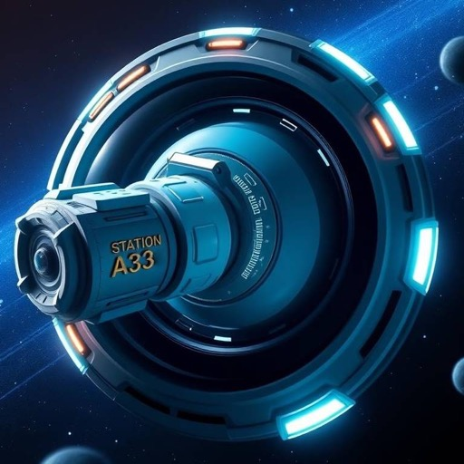

# Station A33 [](https://github.com/AngleOpera/StationA33/actions/workflows/build.yml)

[](https://ro.blox.com/Ebh5?af_dp=roblox%3A%2F%2FplaceId%3D129543241385348%26launchData%3Dutm1%25253A0%25252C0%25252Cweb-link%25252Chome-hero-play-button%25252C%25253B&af_web_dp=https%3A%2F%2Fwww.roblox.com%2Fgames%2Fstart%3FplaceId%3D129543241385348%26launchData%3Dutm1%25253A0%25252C0%25252Cweb-link%25252Chome-hero-play-button%25252C%25253B)

[Join the Experience](https://ro.blox.com/Ebh5?af_dp=roblox%3A%2F%2FplaceId%3D129543241385348%26launchData%3Dutm1%25253A0%25252C0%25252Cweb-link%25252Chome-hero-play-button%25252C%25253B&af_web_dp=https%3A%2F%2Fwww.roblox.com%2Fgames%2Fstart%3FplaceId%3D129543241385348%26launchData%3Dutm1%25253A0%25252C0%25252Cweb-link%25252Chome-hero-play-button%25252C%25253B) (BETA)!

## Dev Setup

Install [Roblox Studio](https://www.roblox.com/create), [Visual Studio Code](https://code.visualstudio.com/download), Git and git clone this repo.

### Studio Plugins

- Install [Hoarcekat](https://create.roblox.com/marketplace/asset/4621580428/Hoarcekat) plugin
- Install [BTreesV5](https://create.roblox.com/store/asset/4702098000/BTreesV5) plugin
- Install [rbxts-object-to-tree](https://www.roblox.com/library/3379119778/rbxts-object-to-tree) plugin

### Install VSCode Extensions

- [Rojo](https://marketplace.visualstudio.com/items?itemName=evaera.vscode-rojo)
- [Rojo UI](https://marketplace.visualstudio.com/items?itemName=muoshuu.rojo-ui)
- [Rojo Explorer](https://marketplace.visualstudio.com/items?itemName=Meqolo.rojo-explorer)
- [Selene](https://marketplace.visualstudio.com/items?itemName=Kampfkarren.selene-vscode)
- [StyLua](https://marketplace.visualstudio.com/items?itemName=JohnnyMorganz.stylua)
- [Roblox LSP](https://marketplace.visualstudio.com/items?itemName=Nightrains.robloxlsp)
- [Roblox TS](https://marketplace.visualstudio.com/items?itemName=Roblox-TS.vscode-roblox-ts)
- [TestEZ Companion](https://marketplace.visualstudio.com/items?itemName=tacheometrist.testez-companion)

### Install Rojo and TestEZ Companion

- VSCode > Command+Shift+P > `TestEZ Companion: Install Studio plugin`
- VSCode > Command+Shift+P > `Rojo: Open Menu`

Use the menu to install Rojo and Roblox Studio Plugin. Then `Click to start live syncing`.

### Install Aftman

- Install [aftman](https://github.com/LPGhatguy/aftman/releases) then run
 
```console
aftman install
lune --version
```

### Install Node.js 18.18.0 with Node Version Manager:

```console
curl -o- https://raw.githubusercontent.com/nvm-sh/nvm/v0.39.1/install.sh | bash
echo ". ~/.nvm/nvm.sh" >> ~/.zprofile
nvm install 18.18.0
nvm use 18.18.0
node --version
npm install --global yarn
```

## Build and open `StationA33.rbxl`

```console
yarn && yarn build && yarn start
```
